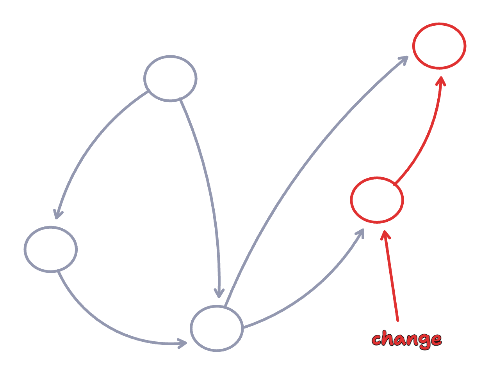
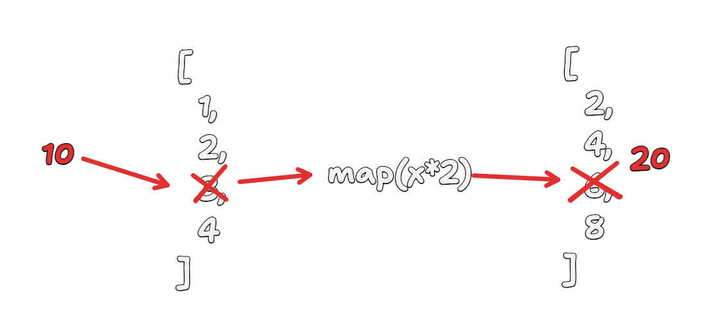

<!-- class: invert -->
<style>
img[alt~="center"] {
  display: block;
  margin: 0 auto;
}
</style>

# Incremental Computation
06/20/2024 - Matt Wonlaw, Rocicorp

---

# Signals



---

# Problem

- Signals are a good start (reactive, only run sub-graphs) but...
- They're not incremental over collections

---
# Example

```ts
x.map(..).filter(..).reduce(..);
```

## Any modification to `x` results in `N` array copies.

---
# Example 2
```ts
const issues = Array.from({length: 100_000}, genIssues);
const fooIssues = issues.filter((issue) => /.*foo.*/.test(issue.title));
```

## Any modification of `issues` re-scans `100k` items
- won't scale having to many such queries

---

# Incremental Computation Allows...

1. Arbitrarily complex queries over collections
2. Arbitrarily deep compute pipelines

---

# Basic Implementation

---

# Terminology

- **Pipeline** - a chain of computations.
E.g., `x.map.filter.reduce`
- **Source** - the data provider and root of the pipeline. 
E.g., the `x` in `x.map.filter.reduce`
- **Operator** - an internal node in a pipeline.
E.g., `map` / `filter` / `reduce` / `join`
- **View** - the final result of a pipeline.
E.g., `const view = x.map.filter.reduce`
- **Difference** - a change to a source or view

---

# Simple Pipeline
`numbers.map(x => x*2)`


---

# Incremental `map`
`numbers.map(x => x*2)`

- Map already is incremental
- Only depends on a single, not the entire collection
- The problem is preserving a relationship between `source` and `view`

---

# Incremental `map`
`numbers.map(x => x*2)`



---

# Preserving View & Source Relationship

- A modification of an input in the source should modify the corresponding output
- Options:
  1. Make the `source` and `view` each a `Map<K, V>` to associate items with a key
  2. Make the `source` and `view` take a `comparator<S, V>`
- Option (1): Diffs take the form of `[key, value]`
- Option (2): Diffs are still just the `value`

---

# Tracking Deletes

  1. Add an `event type` to the difference event

---

Putting it together


---

# Notes:

1. `filter` can be implemented similarly
2. `join` and `reduce` do need to consider past values. There operators require "memory" to make them incremental.

---

# Modeling SQL

SELECT = `map`
```ts
// SELECT title FROM issue
issues.map(i => i.title)
```

WHERE = `filter`
```ts
// SELECT * FROM issue WHERE priority = 1
issues.filter(i => i.priority = 1)
```

WHERE .. AND .. = `filter.filter`
```ts
// SELECT * FROM issue WHERE priority = 1 AND status = 1
issues.filter(i => i.priority = 1).filter(i => i.status = 1)
```

---

# Modeling SQL


WHERE .. OR .. = `x.filter.concat(x.filter).distinct`
```ts
// SELECT * FROM issue WHERE priority = 1 OR status = 1
issues.filter(i => i.priority = 1).concat(issues.filter(i => i.status = 1)).distinct(i => i.id)
```

GROUP BY (or any aggregation) = `reduce`
```ts
// SELECT * FROM issue GROUP BY status
issues.reduce((acc, issue) => {
  const existing = acc.get(issue.status);
  if (existing) {
    existing.push(issue);
  } else {
    acc.set(issues.status, [issue]);
  }
}, new Map())
```

---

# Modeling SQL

JOIN = `join`
Custom operator that correlates two streams. Conceptually:
```ts
// SELECT * FROM issue JOIN user ON issue.owner_id = user.id
issues.map(issue => {
  const user = users.get(issue.owner_id);
  if (user) {
    return {
      issue,
      user
    };
  }
  return undefined;
}).filter(row => row !== undefined)
```

But updated to handle `difference events` (`{type: 'add', value: v}, {type: 'remove', value: v}`), be incremental and respond to changes in either the `user` or `issue` table.

--- 

# Further Topics

- Subqueries
- Recursive queries
- Sharing structure between pipelines for efficiency
- First run & query planning
- Theory: https://github.com/vmware-archive/database-stream-processor/blob/main/doc/vldb23/main.pdf
- In our new product: https://zerosync.dev/