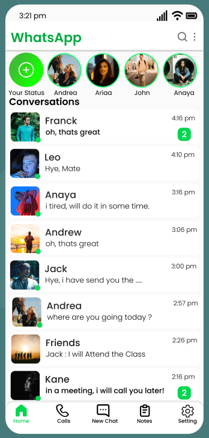
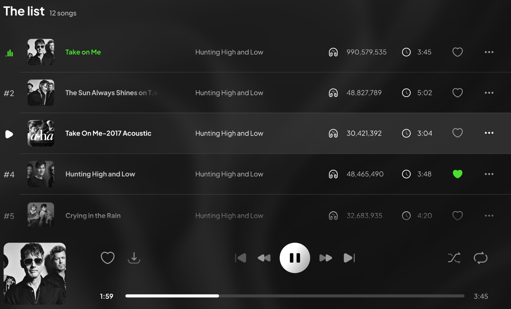
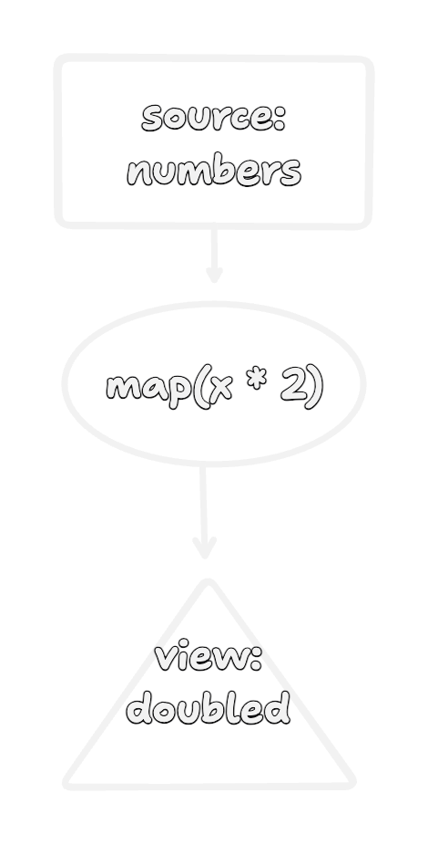
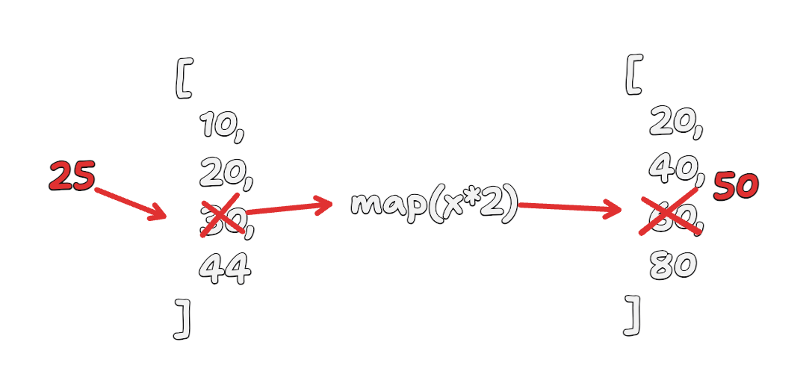
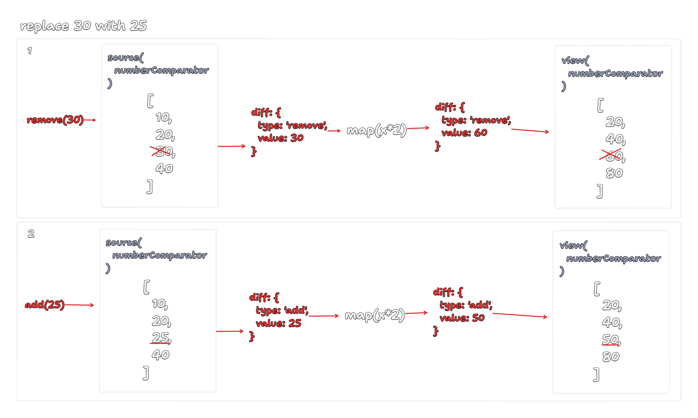
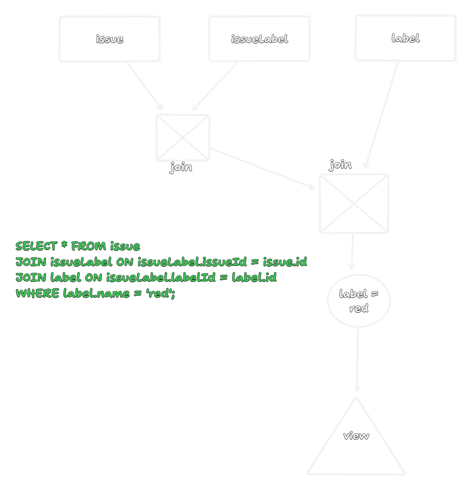
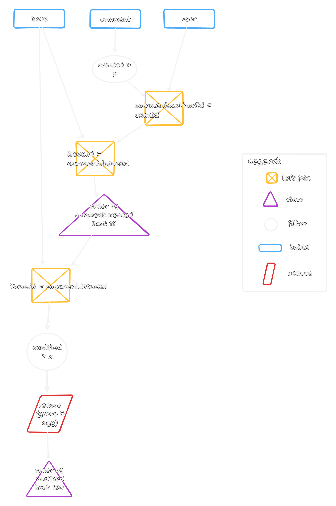

<!-- class: invert -->
<style>
img[alt~="center"] {
  display: block;
  margin: 0 auto;
}
</style>

# Incremental View Maintenance (IVM)
06/23/2024 - Matt Wonlaw, Rocicorp

---

# Why talk about IVM @ a Local-First event?

---

# Apps are views over data

---

<div class="columns">
<div>



```sql
SELECT
  thread.name,
  (SELECT array(name) FROM user WHERE user.id IN thread.participants)
  as participants,
  (SELECT object(name, date) FROM message 
    WHERE message.threadId = thread.id LIMIT 1)
  as lastMessage
FROM thread;
```

</div>
<div>



```sql
SELECT 
  track.*,
  (SELECT array(artist.name) FROM artist
    JOIN trackArtist WHERE trackArtist.trackId = track.id)
FROM playlist
  JOIN trackPlaylist
  JOIN track
```

</div>
</div>

---


# As the state in the database changes, views should automatically update.

re-running every query on state change is too expensive.

---

# Introducing IVM

- Think of it as:
  - A data dependency graph (like signals) plus
  - Incremental computation over collections
- E.g., `map` / `reduce` / `filter` but without making copies and by only running compute over modified items

---
# Without IVM

```ts
x.map(..).filter(..).reduce(..);
```

## Any modification to `x` results in `N` array copies.

---
# Without IVM
```ts
const issues = Array.from({length: 100_000}, genIssues);
const fooIssues = issues.filter((issue) => /.*foo.*/.test(issue.title));
```

## Any modification of `issues` re-scans `100_000` items

---

# Implementing IVM

---

# Terminology

- **Pipeline** - a chain of computations.
E.g., `x.map.filter.reduce`
- **Source** - the data provider and root of the pipeline. 
E.g., the `x` in `x.map.filter.reduce`
- **Operator** - an internal node in a pipeline.
E.g., `map` / `filter` / `reduce` / `join`
- **View** - the final result of a pipeline.
E.g., `const view = x.map.filter.reduce`
- **Difference** - a change sent through the pipeline

---

# Simple Pipeline
`doubled = numbers.map(x => x*2)`



---

# Incremental `map`
`numbers.map(x => x*2)`

- Map already is incremental
- Only depends on a single, not the entire collection
- The problem is preserving a relationship between `source` and `view`

---

# Incremental `map`
`numbers.map(x => x*2)`



---

# Preserving View & Source Relationship

- A modification of an input in the source should modify the corresponding output
- Options:
  1. Make the `source` and `view` each a `Map<K, V>` to associate items with a key
  2. Make the `source` and `view` take a `comparator<S, V>`
- Option (1): Diff events take the form of `[key, value]`
- Option (2): Diff events are still just the `value`

---

# Tracking Deletes, Updates, Adds

  - Add an event `type` to the difference event

```ts
type DifferenceEvent<T> = {
  type: 'add' | 'remove',
  value: T
};
```

- `update` is modeled as `remove` followed by `add`

---

Putting it together


---

# Notes:

1. `filter` can be implemented similarly
2. `join` and `reduce` operators need to consider past values. Require "memory" to make them incremental.
3. Duplicate entries in a collection can be handled by adding a multiplicity to difference events.

```ts
type DifferenceEvent<T> = {
  multiplicity: number; // -N: remove N times. +N: add N times. 0: no-op.
  value: T;
};
```

---

# An incremental query language with incremental `map/reduce/filter/join`?

---

# Example: Modeling SQL

SELECT = `map`
```ts
// SELECT title FROM issue
issues.map(i => i.title)
```

WHERE = `filter`
```ts
// SELECT * FROM issue WHERE priority = 1
issues.filter(i => i.priority = 1)
```

WHERE .. AND .. = `filter.filter`
```ts
// SELECT * FROM issue WHERE priority = 1 AND status = 1
issues.filter(i => i.priority = 1).filter(i => i.status = 1)
```

---

# Example: Modeling SQL


WHERE .. OR .. = `x.filter.concat(x.filter).distinct`
```ts
// SELECT * FROM issue WHERE priority = 1 OR status = 1
issues.filter(i => i.priority = 1).concat(issues.filter(i => i.status = 1)).distinct(i => i.id)
```

GROUP BY (or any aggregation) = `reduce`
```ts
// SELECT * FROM issue GROUP BY status
issues.reduce((acc, issue) => {
  const existing = acc.get(issue.status);
  if (existing) {
    existing.push(issue);
  } else {
    acc.set(issues.status, [issue]);
  }
}, new Map())
```

---

# Example: Modeling SQL

JOIN = `join`
Custom operator that correlates two streams. Conceptually:
```ts
// SELECT * FROM issue JOIN user ON issue.owner_id = user.id
issues.map(issue => {
  const user = users.get(issue.owner_id);
  if (user) {
    return {
      issue,
      user
    };
  }
  return undefined;
}).filter(row => row !== undefined)
```

But updated to handle `difference events`, be incremental and respond to changes in either the `user` or `issue` table.

---

# Modeling SQL
1. Map each language construct to an incremental `filter` / `map` / `reduce` / `join` / `concat` / `distinct` operator
2. Wire these operators together in a DAG

---

Example DAGs



---

<div class="columns">
<div>

```sql
SELECT
  title,
  (SELECT
    json_group_array(json_object(
      'body', body,
      'author', (SELECT
        json_group_array(name)
        FROM user WHERE user.id = comment.authorId
      )
    )) FROM comment
    WHERE created > x AND comment.issueId = issue.id
    ORDER BY created ASC LIMIT 10
   ) AS comments
FROM issue WHERE modified > x ORDER BY modified DESC LIMIT 100
```

I.e.,

```ts
issue.select(
  'title',
  iq => iq.related('comments')
    .where('created', '>', date)
    .select(
      'body',
      cq => cq.related('author').select('name')
    )
    .order('created').limit(10),
).order('modified', 'desc').limit(100);
```

</div>
<div>



</div>
</div>

---

# Demo

- Linearite 1 mil
- ZQL vs SQLite

--- 

# Further Topics

- Subqueries
- Recursive queries
- Normalizing queries
- Sharing structure between pipelines for efficiency
- First run & query planning
- Reducing memory consumption of `join` & `reduce`
- Re-ordering the DAG
- Index creation
- Order By & Limit: properties of the `view`

---

# Resources

- Incremental Query Language Theory: https://github.com/vmware-archive/database-stream-processor/blob/main/doc/vldb23/main.pdf
- Signals: http://adapton.org/
- In our new product as "ZQL (Zero Query Language)" https://zerosync.dev/